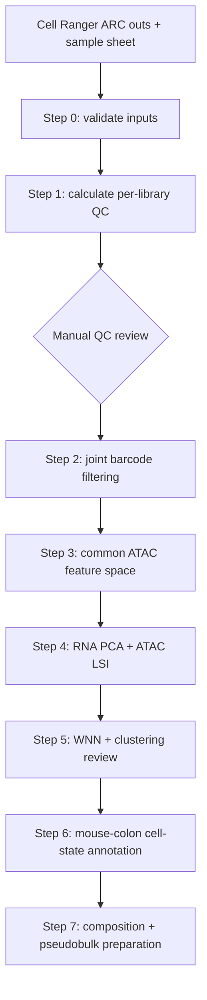

# Workflow and checkpoint contract

This document defines what every stage is allowed to read and write. The contract keeps the workflow restartable, separates manual decisions from computation, and makes the analysis history auditable.



## Checkpoint rules

1. A step reads only original data, configuration files, or completed earlier checkpoints.
2. A step never overwrites its input checkpoint.
3. Large checkpoints are written to SOL scratch, not GitHub.
4. Small decision files, sample metadata, QC decisions, and annotation records are version-controlled.
5. A completion marker is written only after all required outputs for that step succeed.
6. Manual biological decisions should be documented separately from computationally generated intermediate objects.
7. CON-versus-HFD treatment inference is descriptive in this dataset because diet is confounded with pooled-library identity.

## Step 0 - Environment and inputs

### Inputs

- `config/project_config.R`
- `config/datasets/<dataset_version>/samples.csv`
- Cell Ranger ARC `outs/` directories
- GRCm39 / GENCODE vM33 reference annotation

### Outputs

Outputs are written under:

```text
OUTPUT_DIR/00_run_info/
```

Expected records include:

- `package_preflight.csv`
- `compute_environment.csv`
- `sessionInfo.txt`
- `sample_sheet_used.csv`
- `cellranger_input_report.csv`
- `GRCm39_GENCODE_vM33_gene_annotation.rds`
- `STEP_00_COMPLETE.txt`

### Decision point

Are the expected files, software environment, sample metadata, genome build, and Cell Ranger outputs present and internally consistent?

### Experimental-design limitation

The CON library contains colon epithelial cells pooled from 6 mice:

- 2 female
- 4 male

The HFD library contains colon epithelial cells pooled from 10 mice:

- 2 female
- 8 male

Individual mouse identities are not recoverable after pooling. Therefore, pooled-library identity and diet condition are completely confounded.

The nuclei within a library are not independent biological replicates for diet-level inference.

---

## Step 1 - Calculate per-library QC

### Inputs

- paired H5 matrix for each Cell Ranger ARC library
- ATAC fragment file and tabix index
- per-barcode Cell Ranger metrics
- saved GRCm39 / GENCODE vM33 annotation
- `config/datasets/<dataset_version>/samples.csv`

### Main operations

For each library separately:

- import paired RNA and ATAC measurements;
- attach sample and pool metadata;
- calculate RNA QC metrics;
- calculate ATAC QC metrics;
- calculate mitochondrial and ribosomal fractions;
- calculate TSS enrichment;
- calculate nucleosome signal;
- import Cell Ranger FRiP-related metrics;
- apply only a near-empty RNA prefilter before doublet detection;
- calculate doublet classifications using `scDblFinder`.

The purpose of Step 1 is measurement, not final filtering.

### Outputs

Expected outputs include:

```text
01_qc/checkpoints/<sample>_qc_metrics_unfiltered.rds
01_qc/metadata/<sample>_qc_metrics.csv
01_qc/plots/<sample>_before_filtering_*.pdf
```

as well as threshold suggestions and:

```text
01_qc/STEP_01_COMPLETE.txt
```

### Decision point

None yet.

Step 1 calculates QC metrics and provides starting threshold suggestions. Those suggestions are not automatically treated as final filtering decisions.

---

## Step 2 - Review QC and filter

### Inputs

- Step 1 QC checkpoints
- Step 1 QC tables
- Step 1 QC plots
- reviewed `config/datasets/<dataset_version>/qc_thresholds.csv`

### Main operations

- inspect RNA and ATAC QC distributions separately for each library;
- review automated threshold suggestions;
- record final reviewed thresholds;
- calculate separate RNA, ATAC, and doublet pass/fail decisions;
- combine those decisions into one final barcode-level `qc_pass`;
- retain only nuclei that pass the joint Multiome QC decision;
- save one post-QC object per library.

RNA and ATAC are reviewed separately because they measure different technical failure modes, but the final keep/remove decision is joint because both measurements originate from the same nucleus.

### Outputs

Expected outputs include:

```text
02_objects/<sample>_post_QC.rds
01_qc/metadata/<sample>_qc_decision_all_barcodes.csv
01_qc/metadata/<sample>_post_QC_metadata.csv
01_qc/qc_cell_retention_summary.csv
01_qc/qc_thresholds_used.csv
```

plus threshold-review and after-filtering plots.

Completion marker:

```text
02_objects/STEP_02_COMPLETE.txt
```

### Current retained nuclei

| Library | Retained | Starting nuclei | Retention |
|---|---:|---:|---:|
| `Ppar-CON-1` | 8,072 | 12,530 | 64.42% |
| `Ppar-HFD-1` | 3,863 | 5,131 | 75.29% |

### Decision point

Final QC thresholds, reviewer information, review date, notes, and approval are recorded in `config/datasets/<dataset_version>/qc_thresholds.csv`.

---

## Step 3 - Build a common ATAC feature space

### Why this step exists

The two Cell Ranger libraries were initially quantified against independently generated peak sets.

Directly comparing or combining those ATAC assays would therefore mean that the rows of the two matrices do not represent exactly the same genomic features.

Step 3 constructs one canonical ATAC feature space and requantifies both post-QC libraries against it.

### Inputs

- Step 2 post-QC objects
- Cell Ranger fragment files
- saved GRCm39 / GENCODE vM33 annotation

### Main operations

- extract ATAC peak ranges from each post-QC library;
- combine overlapping peak ranges into one canonical common feature set;
- preserve the coordinate representation used by the existing Cell Ranger/Signac objects;
- requantify each post-QC nucleus against exactly the same ATAC feature space;
- replace each sample-specific ATAC assay with the common-feature representation;
- validate that feature coordinates are identical across the resulting objects.

The common-feature requantification uses:

```r
keep_all_features = FALSE
```

because validation with the installed Signac version showed that `keep_all_features = TRUE` severely undercounted fragments in this dataset.

### Current common feature space

Original peak counts:

| Library | Original peaks |
|---|---:|
| CON | 120,679 |
| HFD | 95,915 |

Final canonical common peak set:

```text
130,476 peak ranges
```

### Outputs

Common peak records:

```text
03_common_peaks/GRCm39_common_ATAC_peaks.rds
03_common_peaks/GRCm39_common_ATAC_peaks_coordinates.tsv
```

Common-feature post-QC objects:

```text
03_objects/Ppar-CON-1_post_QC_common_ATAC.rds
03_objects/Ppar-HFD-1_post_QC_common_ATAC.rds
```

The coordinate table is intentionally stored as a TSV rather than labeled as standards-compliant BED because the numeric coordinates preserve the representation used internally by the existing Signac objects.

### Decision point

Do both libraries map correctly into the same ATAC feature space with:

- identical feature coordinates;
- credible fragment totals;
- comparable numbers of detected features;
- preserved genome-build consistency?

---

## Step 4 - Merge and reduce dimensions

### Inputs

- Step 3 common-ATAC objects
- Step 3 common peak set
- saved genome annotation

### Important analysis choice

The libraries are merged without batch integration.

Because pooled-library identity and diet are completely confounded, treating library differences as a removable batch effect could also remove genuine diet-associated biology.

The resulting comparison therefore preserves observed differences while acknowledging that biological and library-specific effects cannot be statistically separated in the current design.

### RNA workflow

RNA is processed using:

- log normalization;
- 3,000 highly variable genes;
- scaling;
- 50 principal components.

Exploratory RNA structure is visualized using:

```text
PCs 1-30
```

No regression is performed for:

- `sample_id`
- diet
- mitochondrial percentage

The first two would directly remove the primary biological contrast, while mitochondrial signal has already been addressed through QC.

### ATAC workflow

ATAC is processed using:

- TF-IDF normalization;
- informative feature selection;
- SVD / latent semantic indexing;
- 50 LSI dimensions.

The association between every LSI dimension and ATAC sequencing depth is calculated explicitly.

In this dataset:

```text
LSI 1 Spearman rho with ATAC depth ~= -0.992
```

Therefore, LSI 1 is excluded from downstream ATAC neighborhood construction.

Exploratory ATAC structure uses:

```text
LSI dimensions 2-30
```

### Outputs

Outputs are written under:

```text
04_reduction/
```

The primary checkpoint is:

```text
04_reduction/Ppar_iKO_multiome_merged_reduced.rds
```

Additional outputs include:

- RNA PCA summaries;
- RNA exploratory UMAP;
- ATAC LSI summaries;
- ATAC exploratory UMAP;
- LSI-depth correlation results;
- validation tables;
- Step 4 completion marker.

### Current merged object

```text
11,935 nuclei
33,696 RNA features
130,476 ATAC features
```

The merged object retains two fragment objects and the GRCm39 gene annotation.

### Decision point

Do RNA and ATAC independently recover coherent biological structure without complete global separation by library?

---

## Step 5 - Build WNN and evaluate clustering

### Inputs

- finalized Step 4 merged reduced object

Step 5 does not silently recalculate PCA or LSI. It consumes the dimensional-reduction decisions established in Step 4.

### WNN dimensions

RNA:

```text
PCs 1-30
```

ATAC:

```text
LSI dimensions 2-30
```

### Main operations

- construct weighted nearest neighbors using RNA and ATAC representations;
- calculate per-cell RNA and ATAC modality weights;
- construct WNN graph objects;
- calculate a WNN UMAP;
- cluster over a predefined resolution grid;
- compare cluster stability and granularity;
- inspect library representation within clusters;
- inspect mouse-colon epithelial marker programs;
- manually choose one working clustering resolution.

### WNN objects

The finalized Seurat object contains:

```text
weighted.nn
wknn
wsnn
RNA.weight
ATAC.weight
```

The modality weights are explicitly validated to ensure that they are:

- present;
- finite;
- between 0 and 1.

The overall median modality weights are approximately:

```text
RNA.weight  = 0.650
ATAC.weight = 0.350
```

These values describe the relative contribution of each modality to neighborhood construction for the nuclei in this dataset. They are not global weights manually assigned to RNA and ATAC.

### Resolution grid

The reviewed grid is:

```text
0.2
0.4
0.6
0.8
1.0
```

Observed cluster counts:

| Resolution | Clusters |
|---:|---:|
| 0.2 | 14 |
| 0.4 | 19 |
| 0.6 | 21 |
| 0.8 | 23 |
| 1.0 | 23 |

### Reviewed working resolution

```text
0.8
```

This resolution was selected after comparing:

- cluster stability;
- biologically coherent subdivisions;
- the WNN embedding;
- colon epithelial marker programs;
- library representation.

Resolution was not chosen simply to produce a predetermined number of cell types.

### Mouse-colon marker audit

Step 5 performs a preliminary marker-program audit using genes representing:

- stem / crypt populations;
- proliferative transit-amplifying states;
- absorptive colonocytes;
- goblet cells;
- deep-crypt secretory cells;
- enteroendocrine cells;
- tuft cells.

This audit supports resolution review but does **not** assign final biological identities.

### Outputs

Outputs are written under:

```text
05_wnn/
```

The primary checkpoint is:

```text
05_wnn/Ppar_iKO_multiome_WNN_clustered.rds
```

Additional outputs include:

- WNN UMAP plots;
- RNA and ATAC modality-weight summaries;
- candidate-resolution UMAPs;
- clustering-resolution summary tables;
- `mouse_colon_marker_audit.csv`;
- chosen cluster-size summaries;
- `STEP_05_COMPLETE.txt`.

### Decision point

Does the selected working resolution separate biologically coherent states without merely fragmenting continuous structures?

### Important limitation

Cluster representation may be compared descriptively between the pooled CON and HFD libraries.

However, formal cell-state abundance testing is not supported because:

```text
diet == pooled-library identity
```

and there are not multiple independently measured libraries within each diet.

---

## Step 6 - Mouse-colon cell-state annotation

### Status

Next analysis unit.

### Inputs

- finalized Step 5 WNN object
- reviewed WNN resolution `0.8`
- cluster-level RNA marker results
- mouse-colon epithelial marker programs
- targeted ATAC evidence where informative

### Planned strategy

Step 6 will separate **marker discovery** from **annotation decisions**.

Planned operations include:

- identify RNA markers for every WNN cluster;
- examine marker effect size and prevalence;
- evaluate coordinated marker programs rather than single genes;
- identify broad epithelial lineages;
- refine broad identities into biologically supported cell states;
- investigate ambiguous clusters individually;
- audit sex-associated transcription where relevant;
- use ATAC accessibility or gene activity to support selected annotations;
- inspect RNA/ATAC concordance for important populations;
- record preliminary and final annotations;
- assign reviewed labels back to the Seurat object.

Cell-level marker statistics may help rank annotation evidence, but their P values will not be interpreted as replicated treatment inference.

### Planned version-controlled decision record

Annotation decisions should be stored in:

```text
config/cluster_annotations.csv
```

The table should retain fields such as:

```text
cluster
preliminary_label
final_label
broad_lineage
rna_evidence
atac_evidence
confidence
reviewer
review_date
notes
```

This keeps biological interpretation reviewable independently of the large Seurat object.

### Planned outputs

Outputs will be written under:

```text
06_annotation/
```

Expected outputs include:

- cluster-level RNA marker tables;
- marker-program summaries;
- annotation-support plots;
- targeted RNA/ATAC validation outputs;
- reviewed cluster annotation table;
- annotated WNN RDS;
- Step 6 completion marker.

### Decision point

Is each final cell-state label supported by:

1. a coherent RNA marker program;
2. appropriate lineage context;
3. multimodal evidence where needed;
4. documented reviewer judgment?

---

## Step 7 - Composition and pseudobulk preparation

### Status

Planned.

### Inputs

- finalized Step 6 annotated Multiome object

### Planned outputs

Outputs will be separated into:

```text
07_composition/
07_pseudobulk/
```

Potential outputs include:

- descriptive cell-state composition tables;
- per-library cell-state summaries;
- pseudobulk-ready RNA matrices;
- pseudobulk-ready ATAC matrices;
- downstream metadata required for future replicated analyses.

### Statistical limitation

The current experiment contains:

```text
1 pooled CON library
1 pooled HFD library
```

Therefore, this workflow will not treat nuclei as independent replicates for formal:

- differential abundance;
- differential expression;
- differential accessibility;
- diet-effect significance testing.

The current libraries can support descriptive and hypothesis-generating comparisons.

Formal treatment inference requires additional independently measured biological replicates.

---

## Repository versus SOL scratch

### Version-controlled in GitHub

The repository should contain:

- analysis notebooks;
- helper functions;
- project configuration;
- sample metadata;
- reviewed QC thresholds;
- review notes;
- cluster annotation decisions;
- small intentionally retained summary tables;
- documentation.

### Stored outside GitHub on SOL

Large or generated data should remain on SOL scratch, including:

- Cell Ranger outputs;
- FASTQ files;
- fragment files;
- BAM files;
- H5 matrices;
- RDS checkpoints;
- generated figures;
- large result tables;
- intermediate objects.

This separation keeps the repository lightweight while preserving the analysis logic and decision history required to reproduce the workflow.
