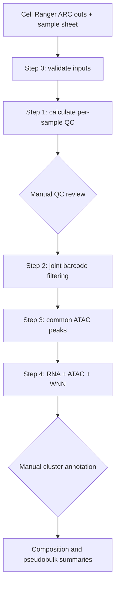

# Workflow and checkpoint contract

This document defines what every stage is allowed to read and write. The contract makes the workflow restartable and keeps manual decisions visible.

## Checkpoint rules

1. A step reads only original data, configuration files, or completed earlier checkpoints.
2. A step never overwrites its input checkpoint.
3. Large checkpoints are written to SOL scratch, not GitHub.
4. Small decision files and sample metadata are version-controlled.
5. A completion marker is written only after all outputs for that step succeed.

## Step 0 — Environment and inputs

Inputs:

- `config/project_config.R`
- `config/samples.csv`
- Cell Ranger ARC `outs/` directories

Outputs under `OUTPUT_DIR/00_run_info/`:

- `package_preflight.csv`
- `compute_environment.csv`
- `sessionInfo.txt`
- `sample_sheet_used.csv`
- `cellranger_input_report.csv`
- `mm10_gene_annotation.rds`
- `STEP_00_COMPLETE.txt`

Decision point: Is each library technically credible at the library level, including its Cell Ranger `web_summary.html`?

## Step 1 — Calculate per-sample QC

Inputs:

- paired H5 matrix, fragments/index, and per-barcode metrics for each sample
- saved mm10 gene annotation

Outputs:

- `01_qc/checkpoints/<sample>_qc_metrics_unfiltered.rds`
- `01_qc/metadata/<sample>_qc_metrics.csv`
- `01_qc/plots/<sample>_before_filtering_*.pdf`
- `01_qc/qc_thresholds_suggested.csv`
- `01_qc/STEP_01_COMPLETE.txt`

Repository change:

- Step 1 fills blank numeric entries in `config/qc_thresholds.csv` with starting suggestions but leaves them unapproved.

Decision point: None yet. Suggestions are not filtering decisions.

## Step 2 — Review and filter

Inputs:

- Step 1 QC tables and checkpoints
- reviewed `config/qc_thresholds.csv`

Outputs:

- `02_objects/<sample>_post_QC.rds`
- `01_qc/metadata/<sample>_qc_decision_all_barcodes.csv`
- `01_qc/metadata/<sample>_post_QC_metadata.csv`
- threshold-preview and after-filtering plots
- `01_qc/qc_cell_retention_summary.csv`
- `01_qc/qc_thresholds_used.csv`
- `02_objects/STEP_02_COMPLETE.txt`

Decision point: threshold values, reviewer, review date, notes, and approval are recorded in `config/qc_thresholds.csv`.

## Planned downstream checkpoints

The exact contracts will be added with their notebooks. The current intended boundaries are:

| Step | Intended checkpoint |
|---:|---|
| 3 | one post-QC/common-peak RDS per sample plus a versioned common-peak BED/GRanges record |
| 4 | merged unannotated WNN RDS with `rna.umap`, `atac.umap`, and `wnn.umap` reductions |
| 5 | cluster-marker tables and resolution-review plots |
| 6 | manual annotation CSV plus annotated WNN RDS |
| 7 | composition tables and replicate-aware pseudobulk matrices |

The pipeline will not perform cell-level diet significance testing. Formal diet inference will be guarded until each diet has sufficient independent biological replicates within a cell population.

